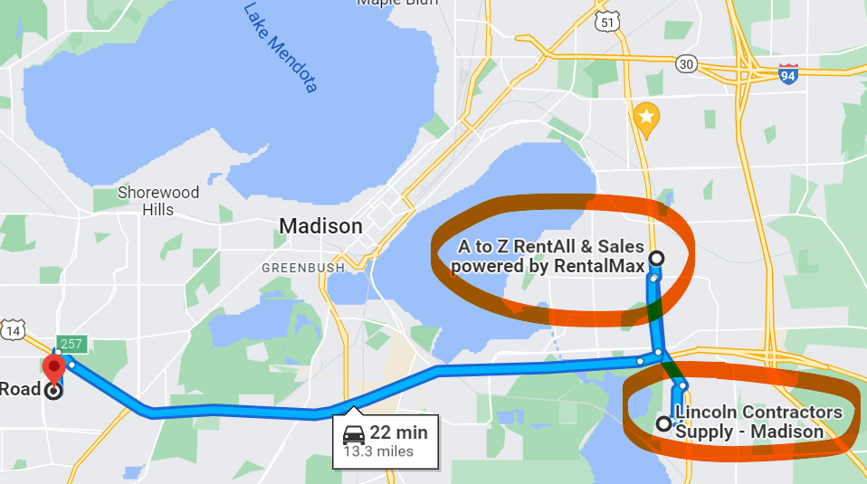

# Summary and project scope


This renovation is designed to obtain maintainable ground cover in the back yard, near the fire pit but not extending past where the large trees begin. 
Essentially, we will be working on the area cleared by Finn in summer 2021.

Grass cover and mowing will prevent re-emergence of woody shrubs and overgrowth.
In the event that later renovations are made, the turf can be easily removed.
This is a one-day renovation assuming there is no rain. 
If it rains, the project will probably need to be delayed until the fall. 


# Project outline 

The area is approximately 4,000 ft^2^. The steps in the renovation renovation include:

1. Till with walk-behind track loader to loosen soil and pulverize remaining woody roots

1. Rake to remove sticks and debris

1. Rough grade with bucket on track loader + rake smooth

1. Slit seed with sun/shade blend of grass seed. Ensure good seed-to-soil contact 

1. Smooth with tracks on skid loader

1. Apply starter fertilizer 

1. Apply paper mulch by hand (chicken-feed style) at rate of 75 lb / 1,000 ft^2^

1. WATER WATER WATER WATER until turf is established

```{r setup, include=FALSE}
knitr::opts_chunk$set(echo = F)

library(purrr)
library(kableExtra)
```

# Geography 


```{r, out.width='90%', fig.pos='!H'}

```


# Equipment rental info

We are responsible for picking up and returning the equipment. 
I have rented an 18-ft trailer from the same location supplying the loader + tiller (Lincoln Contractor Supply). 
It should be compatible with a 2" ball hitch on the 2003 Pilot.

We will then stop at A to Z rentals to pick up the slit seeder. 

We'll return the equipment in the reverse order at the end of the day.

## Skid loader, tiller, trailer 

- Pick up Monday June 6 from Lincoln contractor supply @ 7 AM
- address: [4414 Terminal Dr. McFarland, WI](https://goo.gl/maps/z2m2kzjtvRKcAvdX8)
- phone number: (608) 249-6476

- Must return by 5 PM same day or by 7 AM Tuesday June 7

- spoke w/ Chris 2022-05-02 to reserve for June 3 and Penny on 2022-05-09 to change reservation to Monday June 6

## Powered slit-seeder 

- Pick up from A-Z rentals at [2209 S. Stoughton Rd. Madison WI](https://goo.gl/maps/z2m2kzjtvRKcAvdX8); phone number (608) 222-5004

- originally was scheduled for 7:30 AM pickup but because equipment will likely be going out over the weekend, may need time to be serviced before we can pick up....Probably closer to 9 or 10 AM
- I should call before and see about the timing...if not going to work out to pick up immediately after getting the trailer, may want to 
cancel and look elsewhere. 

- Return by 5 PM same day or 7 AM the following day

- spoke w/ Todd 2022-05-02 to reserve and w/ Bruce on 2022-05-09 to change from Friday to Monday reservation


## Other notes 

- The hitch on the Pilot is rated to 4,500 lb. 
- The CTX loader weighs ~ 3040 lb, plus tiller (320 lb), bucket (245 lb)
- The slid seeder weighs 314 lb

- Total equipment weight: `r sum(c(3040, 320, 245, 314))` lb.

- Existing hitch on Pilot is 1-7/8"; I ordered the 2" hitch needed to pull the trailer from Home Depot on 2022-05-09. It should arrive at Hammersley around May 16. 


______


# Estimated budget

```{r cost-estimates}
x <- tibble::tibble(
    item = c("Walk-behind skid steer w/ tiller and bucket (incl. trailer)", "2\" ball hitch", "Landscape rake", "Powered slit seeder", "Grass seed", "Paper mulch", "Starter fertilizer"),
    estimate = scales::dollar(c(350, 14, 50, 90, 144, 5*44, 40))
)

x %>% tibble::add_case(item = "Total", estimate = scales::dollar(sum(readr::parse_number(x$estimate)))) %>% 
  kbl(format = 'latex', col.names = c("Item", "Estimate"), booktabs = TRUE) %>% 
  row_spec(row = c(0, nrow(x)+1), bold = TRUE) %>% 
  row_spec(row = nrow(x), hline_after = TRUE) %>% 
  kable_styling(latex_options = 'hold_position')


```

